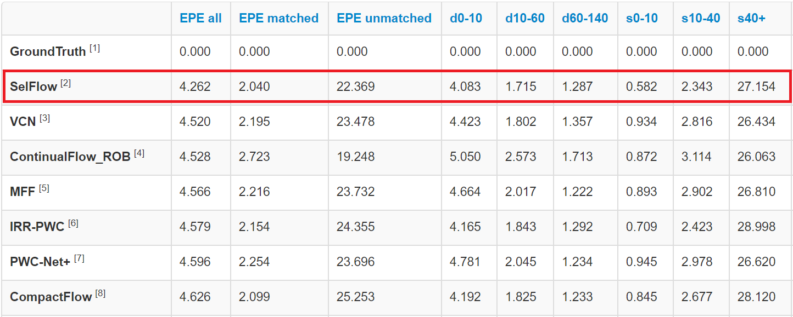

# SelFlow: Self-Supervised Learning of Optical Flow
The official Tensorflow implementation of [SelFlow](https://arxiv.org/abs/1904.09117) (CVPR 2019 Oral). 

Authors: [Pengpeng liu](https://ppliuboy.github.io/), [Michael R. Lyu](http://www.cse.cuhk.edu.hk/lyu/), [Irwin King](https://www.cse.cuhk.edu.hk/irwin.king/), [Jia Xu](http://pages.cs.wisc.edu/~jiaxu/index.html)

- Testing code and part of pre-trained models are available.
- Training code: please refer to [DDFlow](https://github.com/ppliuboy/DDFlow) to implement. With the current testing code and DDFlow code, the only thing you need to do is write a superpixel generation script. We use [skimage.segmentation.slic](https://scikit-image.org/docs/dev/api/skimage.segmentation.html#skimage.segmentation.slic) to generate superpixels. 
- Raw Sintel data used in the paper: download images from the [link](https://media.xiph.org/sintel/sintel-2k-png/), resize the image to resolution [1024*436] with nearest neighbor sampling and find the training clips in [clip split](./img_list/sintel_raw_clip_split.txt) 


Our SelFlow is the 1st place winner on [Sintel Optical Flow Benchmark](http://sintel.is.tue.mpg.de/results) from November 2018 to November 2019.


## Requirements
- **Software:** The code was developed with python (both python 2 and python 3 are supported), opencv, tensorflow 1.8 and anaconda (optional). It's okay to run without anaconda, but you may need to install the lacking packages by yourself when needed. For tensorflow of different versions, you may need to modify some functions accordingly.
### Dockerfile
There is a dockerfile with the neccesary dependencies which you can build with the command below.

```docker build --network=host -t selflow .```

You can run the docker image with command below.

```docker run -it --rm --network=host -w /SelFlow selflow```

You can then follow the instructions below to test the model

## Usage
**By default, you can get the testing results using the pre-trained Sintel model by running:**

    python main.py

Both forward and backward optical flow and their visualization will be written to the output folder. 

**Please refer to the configuration file template [config](config/config.ini) for a detailed description of the different operating modes.**


#### Testing
- Edit [config](config/config.ini), set *mode = test*.
- Create or edit a file, where the first three columns are the input image names, and the last column is the saving name. 
- Edit [config](config/config.ini) and set *data_list_file* to the file directory.
- Edit [config](config/config.ini) and set *img_dir* to the directory of your image directory.
- Run *python main.py*.
- **Note** 
    -  Supervised pre-trained model: we normalize each channel to be standard normal distribution, please set *is_normalize_img=True*.
    -  Unsupervised pre-trained model: please set *is_normalize_img=False*.

## Pre-trained Models
Check [models](./models) for our pre-trained models on different datasets.

## Citation
If you find SelFlow useful in your research, please consider citing:

    @inproceedings{Liu:2019:SelFlow, 
    title = {SelFlow: Self-Supervised Learning of Optical Flow}, 
    author = {Pengpeng Liu and Michael R. Lyu and Irwin King and Jia Xu}, 
    booktitle = {CVPR}, 
    year = {2019}
    }
    
    @inproceedings{Liu:2019:DDFlow, 
    title = {DDFlow: Learning Optical Flow with Unlabeled Data Distillation}, 
    author = {Pengpeng Liu and Irwin King and Michael R. Lyu and Jia Xu}, 
    booktitle = {AAAI}, 
    year = {2019}}


## Acknowledgement
Part of our codes are adapted from [PWC-Net](https://github.com/NVlabs/PWC-Net) and [UnFlow](https://github.com/simonmeister/UnFlow), we thank the authors for their contributions.
